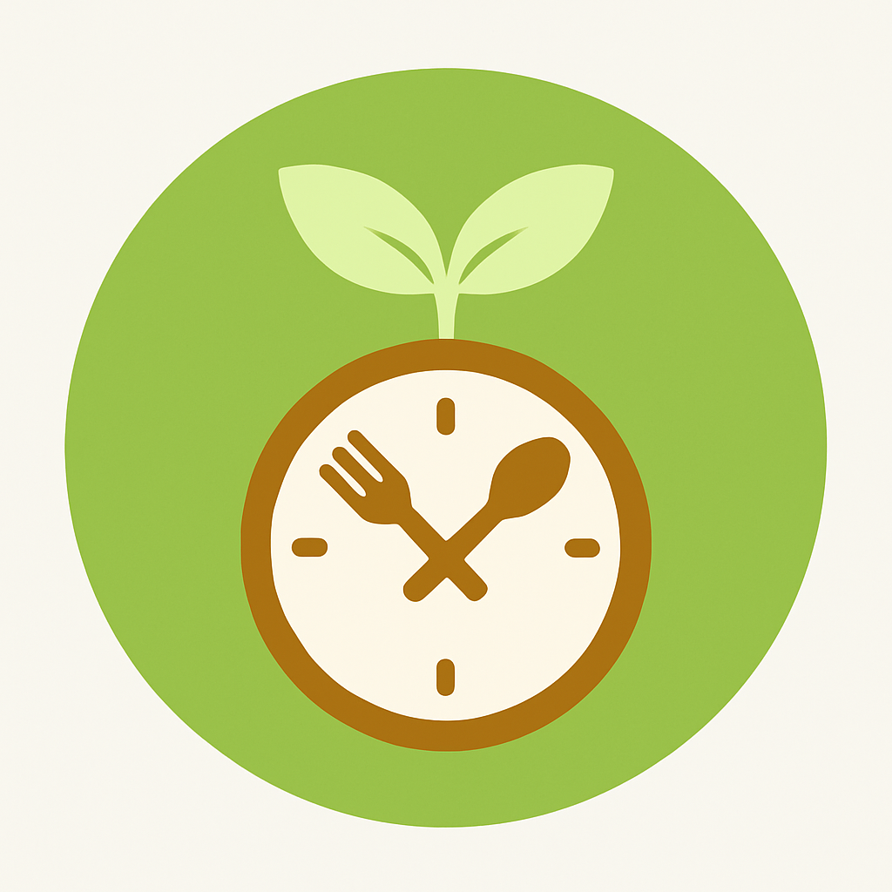
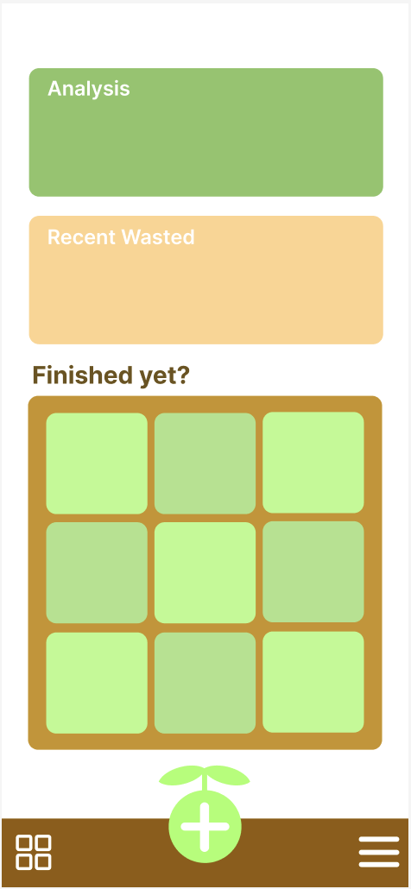
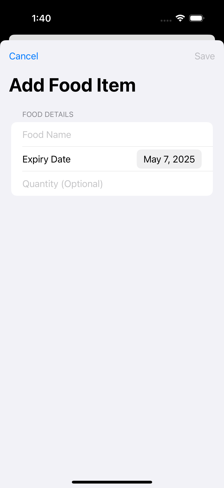
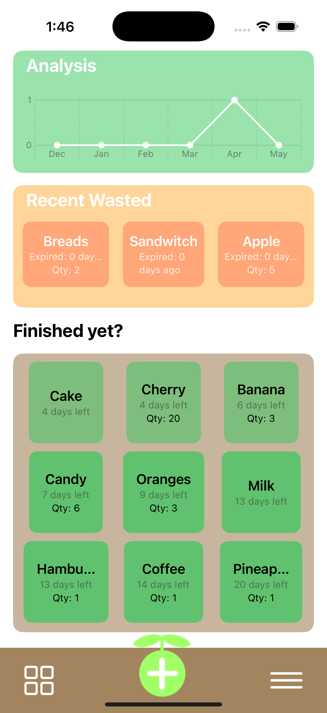
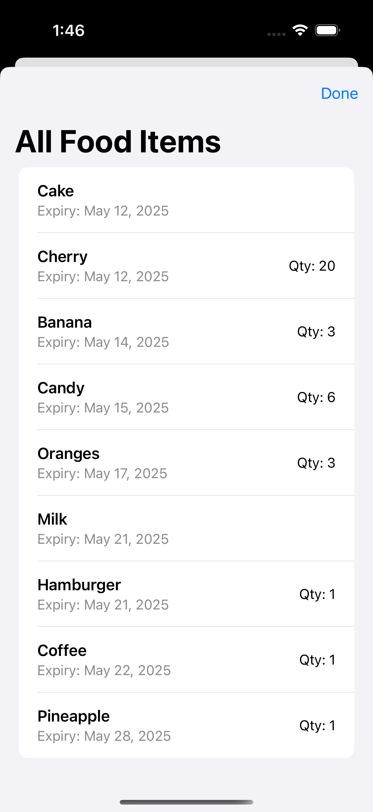
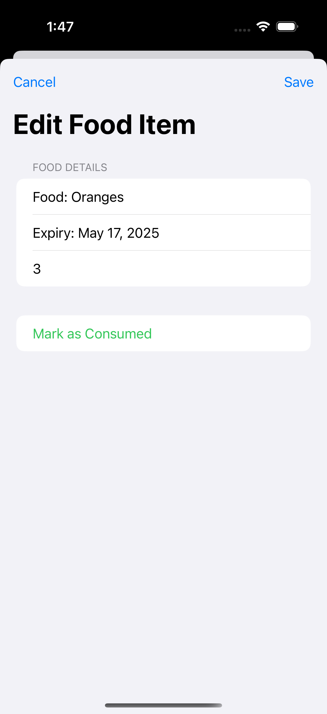

# Food Expiry Tracker 

A Swift-based iOS application designed to help users track food expiration dates and reduce food waste through intuitive visual management.




## Features

### Core Functionality
- Smart Food Tracking: Add and manage food items with names, expiry dates, and quantities
- Visual Expiry Indicators: Color-coded cards showing urgency based on days until expiration
- Expired Items Monitor: Separate section tracking recently wasted food items
- Consumption Analysis: Line chart visualization of food consumption patterns over 6 months
- Quick Actions: Mark items as consumed or update quantities with a single tap

### User Interface
- Grid View: 3-column grid layout for easy browsing of food items
- Analysis Dashboard: Visual representation of consumption trends
- Recent Wasted Section: Track and review expired items
- Bottom Navigation: Quick access to all features via custom navigation bar
- Custom Icons: Personalized button images for enhanced user experience

## Technical Stack

- Language: Swift 5.5+
- Framework: SwiftUI
- UI Components: Swift Charts (iOS 16+)
- Data Persistence: UserDefaults with Codable
- Architecture: MVVM Pattern
- Minimum iOS Version: iOS 15.0

## Requirements

- Xcode 14.0+
- iOS 15.0+ (iOS 16.0+ for chart features)
- macOS 12.0+ (for development)

## Project Structure

```
LastBite/
├── ContentView.swift           # Main view container
├── AnalysisView.swift          # Consumption analysis chart
├── RecentlyExpiredView.swift   # Expired items section
├── FoodGridView.swift          # Grid display of active items
├── AddFoodView.swift           # Add new food item form
├── EditFoodView.swift          # Edit existing item form
├── AllFoodListView.swift       # Full list view of all items
└── BottomNavBar.swift          # Bottom navigation bar
├── Assets.xcassets/
│   └── AddButtonImage          # Custom add button image
└── LastBiteApp.swift           # App entry point
```

## Usage

### Main Page


### Adding a Food Item
1. Tap the green circular button at the bottom center of the screen
2. Enter the food name (required)
3. Select the expiry date using the date picker
4. Optionally enter the quantity
5. Tap "Save" to add the item


### Viewing Food Items
- Grid View: See all non-expired items sorted by expiry date in the "Finished yet?" section
- List View: Tap the grid icon (bottom left) to see a full list of all active items
- Expired Items: View recently expired items in the orange "Recent Wasted" section
- Analyzed Consumption: View the line chart in the green "Analysis" section at the top and track your monthly consumption patterns over the last 6 months


### Managing Items
1. Tap any food item card to open the edit screen
2. Update the quantity if needed
3. Tap "Mark as Consumed" to remove the item from tracking
4. Tap "Save" to confirm changes

 
